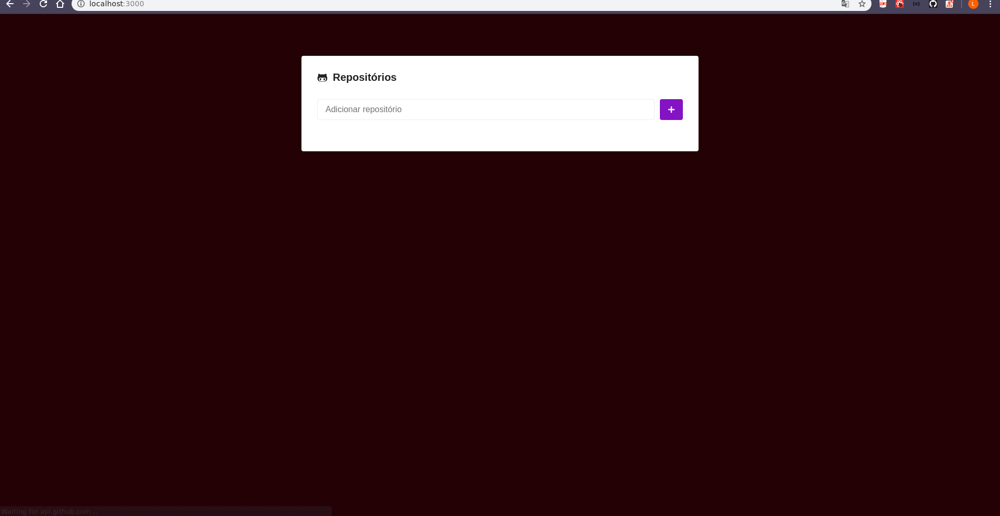

# Descrição
A aplicação consiste em uma interface que pode adicionar repositórios do github e verificar as issues existentes em cada um.

Existe um tratamento de erros para repositórios que não existem, ou repositórios duplicados.

Na página de detalhes existente dentro do repositório é possível navegar entre as páginas e filtrar as issues entre Abertas, fechadas e todas.

# Uso
Necessário: Possuir o node instalado (Com o gerenciador yarn).

Para rodar o resultado abaixo, basta seguir os seguintes passos:
- Clonar o repositório;
- Executar o seguinte comando ```yarn``` no terminal (dentro do diretório) - Isto instala todos os pacotes necessários
- Executar o script yarn start.

O navegador deve abrir com o resultado gravado no gif abaixo.

# Resultado

<h1 align="center">
  
</h1>
